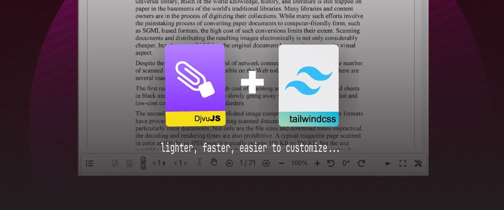

<p align="center"> 

 

</p>

This is fork of an oficial repository of [RussCoder/djvujs](https://github.com/RussCoder/djvujs); yet updated, optimized and powered by [tailwindcss](https://github.com/tailwindlabs/tailwindcss).

## Table of Contents

- [Table of Contents](#table-of-contents)
- [About / О проекте](#about--о-проекте)
- [HowTo](#howto)
- [Tools and supported browsers](#tools-and-supported-browsers)
- [How to build it](#how-to-build-it)
- [How to run it locally](#how-to-run-it-locally)
  - [Tests](#tests)
- [How to pack the extension](#how-to-pack-the-extension)
- [Links](#links)
- [License / Лицензия](#license--лицензия)


## About / О проекте

**DjVu.js** is a program library for working with `.djvu` online. It's written
in JavaScript and can be run in a web browser without any connection with a
server. DjVu.js can be used for splitting (and concatenation) of `.djvu` files,
rendering pages of a `.djvu` document, converting (and compressing) images
into `.djvu` documents and for analyzing of metadata of `.djvu` documents.

**DjVu.js Viewer** is an app which uses DjVu.js to render DjVu
documents. The app may be easily included into any html page. You can look at it
and try it out on the official website (the link is below).

**DjVu.js Viewer browser extension**. By and large, it's a copy of the viewer,
but also it allows opening links to `.djvu` files right in the browser without
downloading them explicitly. The links to the extension are below.

<hr>

**DjVu.js** - это программная библиотека написанная на JavaScript и
предназначенная для работы с файлами формата `.djvu` онлайн. DjVu.js
ориентирована на исполнение в браузере пользователя без связи с сервером.
Библиотека может быть использована для разделения (объединения) файлов `.djvu`,
преобразования картинок в документы `.djvu`, отрисовки страниц
документов `.djvu`, а также для анализа мета данных и структуры `.djvu`
документов.

**DjVu.js Viewer** - приложение, которое можно легко встроить в любую
html-страницу. Данное приложение служит для просмотра документов DjVu
непосредственно в браузере. Вы можете ознакомиться с ним по ссылке ниже.

**Расширение для браузера DjVu.js Viewer**. По большей части это копия
приложения DjVu.js Viewer, однако также расширение позволяет открывать ссылки
на `.djvu` файлы прямо в браузере, не скачивая их явно. Ссылки на расширение
доступны ниже.

## HowTo

- [DjvuJS Library API](./doc/Library%20API.md)
- [i18n](./doc/Translations.md)


## Tools and supported browsers

You need to have Node.js 18+ (although older versions should work too)
and npm 9+ installed to work with the project.

The viewer and the library are supposed to run in a browser. Technically,
it should not be difficult to update the library so that it could be used
in Node.js projects - the main code is pure JS and doesn't rely on
browser specific APIs.

Currently, the following browsers are supported:

```
Chrome >= 88
Firefox >= 78
Safari >= 14
Edge >= 88
```

The list above is conditioned by the [default Vite settings](https://vitejs.dev/guide/build.html#browser-compatibility)
and the support of the [`:where` CSS pseudo class](https://caniuse.com/mdn-css_selectors_where).

## How to build it

Clone the repo and run:

```sh
npm run make
```` 

in the root folder of the repository. The command will install all dependencies
and create bundles of the library and viewer (the `build` folder should
appear).

There is another variant:

```sh
npm run remake
```

It does the same as `make`, but first it removes all git-ignored files 
(including dependencies).

## How to run it locally

If you want to work with the library you should read [the library's README](./library/README.md).

As for the viewer, you have to build the library once and start the dev server.
It can be achieved with the following commands:

```sh
npm run make # run it only once
cd viewer
npm start
```

A page with the viewer will open automatically.

### Tests

Once the dev server has been started, you can run E2E tests via `test*` npm scripts that you can find in
the `viewer/package.json` file.

## How to pack the extension

After the project has been built (`npm run make`), the extension
folder contains all the necessary files. However, there are two manifests:
v2 and v3. You should copy and rename one of them to `manifest.json`.

After it's done, the folder is an unpacked extension - it can be
installed in the "developer mode".

If you want to pack the extension, you can either zip it yourself
or run:

```sh
npm run ext # it uses "npx web-ext", so you will be asked to install the package
```

It will pack the extension with both v2 and v3 manifests.

## Links

- The **official website** with the DjVu.js Viewer demo is https://djvu.js.org
- You may **download the library** and the viewer
  on https://djvu.js.org/downloads
- The **browser extension**
  for [Mozilla Firefox](https://addons.mozilla.org/en-US/firefox/addon/djvu-js-viewer/)
- The **browser extension**
  for [Google Chrome](https://chrome.google.com/webstore/detail/djvujs-viewer/bpnedgjmphmmdgecmklcopblfcbhpefm)
- The **technical documentation** of the library is
  available [in the wiki](https://github.com/RussCoder/djvujs/wiki/DjVu.js-Documentation)
- [CHANGELOG of the library](library/CHANGELOG.md)
- [CHANGELOG of the viewer](viewer/CHANGELOG.md)

## License / Лицензия

The DjVu.js Library is distributed under the terms of [GNU GPL v2](GNU_GPL_v2).
Everything else in this repository (including the DjVu.js Viewer and the browser
extension) is under [The Unlicense](THE_UNLICENSE). Read more in
the [LICENSE file](LICENSE.md).

<hr>

Библиотека DjVu.js распространяется под лицензией [GNU GPL v2](GNU_GPL_v2). Все
остальное в этом репозитории (включая DjVu.js Viewer и расширение для браузера)
является общественным достоянием ([The Unlicense](THE_UNLICENSE)). Читайте
подробнее в [файле лицензии](LICENSE.md).